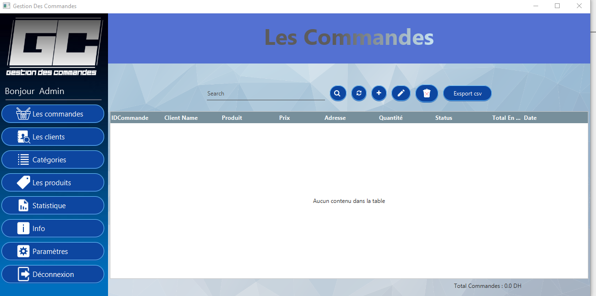

# Gestion De Commandes

### Fonctionnalités

- Système d'authentification avec (login/email)
- Ajouter Des Commandes
- Ajouter et supprimer et modifier (CRUD) des utilisateurs
- Ajouter et supprimer et modifier (CRUD) des Produits
- Recherche multi-critères
- Exportation des donnes format csv
- Statistique des produits les plus vendu
- Validation

---

## Description

javafx desktop application pour gestion de commande

#### Technologies

- JAVA (JAVA FX)
- JDBC
- SQL LITE

---

## Comment utiliser

Creation du jar ou l'utilisation d'un Ide eclipse ou IntelliJ

- login: Admin
- email: Admin@test.net
- Password: pass

## Outils

- IntelliJ
- Scene Builder
- SQL LITE CLI

---
